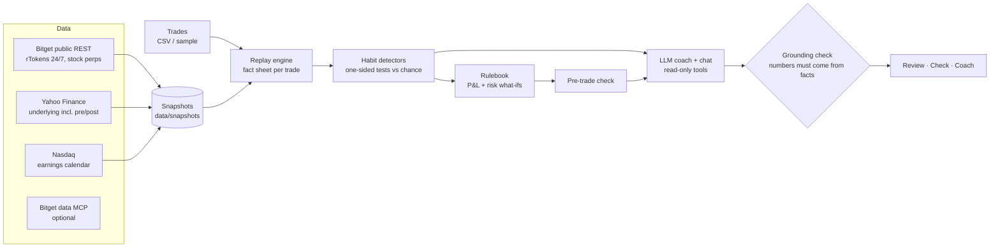

# Hindsight

**Your trades, reviewed.** An AI post-trade coach for people who trade Bitget rTokens (tokenized US stocks) around the clock.

Hindsight replays every trade against real market data, finds the habits that cost you money, proves each one with your own trades, turns them into personal rules with an honest what-if, and checks your next trade idea against them. You decide; it never places orders.

**Live demo:** https://hindsight-puce.vercel.app (no login; a sample trader is preloaded)
Built for the Bitget AI Base Camp Hackathon S2, AI Trading Desk track, sub-theme *Review & Self-Evolution*.

## What it finds

| Habit | What Hindsight tests |
|---|---|
| Chasing moves while Wall Street sleeps | Closed-market buys after the rToken is already up ≥1.5% since the US close, vs how often such moments occurred in your stocks |
| Panic selling while Wall Street sleeps | Closed-market sells after a ≥1.5% drop, vs the same chance baseline; what the next US open did |
| Holding through earnings | Trades crossing an earnings report vs what your holding times would give by chance |
| Cutting winners, holding losers | Exits in profit vs time spent in profit, confirmed by losers being held longer (two tests biased in opposite directions by market drift) |
| Revenge trading | Size of trades opened within 12h of a loss vs your normal size |

## How we know it works

A blind test on simulated traders trading real 2026 rToken prices with randomly hidden habits. Detectors were tuned on 200 development traders; 200 held-out traders were run once:

- **70.6%** of hidden habits found (**82.2%** of strong ones)
- **0.2%** false-alarm rate (1 of 588), **99.7%** precision
- **0 of 16** habit-free traders wrongly accused

Method and limits: [/accuracy](https://hindsight-puce.vercel.app/accuracy). Reproduce with `pnpm blind-test --final`.

## Code calculates, the AI explains



Every number shown comes from deterministic, tested code. The LLM parses trade ideas, writes coaching from JSON facts, and answers questions through read-only tools. A grounding check rejects any AI text containing a number that isn't in the computed facts; coaching falls back to the computed summary, and chat answers show whether their numbers were verified.

## Run it

Requires Node 22+ and pnpm.

```bash
pnpm install
pnpm dev                 # http://localhost:3000, works offline from snapshots
pnpm test                # 41 tests
pnpm blind-test --final  # held-out accuracy test
pnpm snapshot            # refresh market data snapshots
```

AI features need `OPENAI_API_KEY` in `.env.local` (models are configured in `src/lib/ai/models.ts`; switching to Qwen via the Vercel AI Gateway is a one-line change). Without a key, everything else works and coaching shows the computed summaries.

## Layout

```
src/lib/market   data clients, NYSE sessions, rToken vs stock gap, snapshots
src/lib/trades   fill matching, CSV import
src/lib/sim      trader simulator (sample trader + blind test)
src/lib/review   replay, habit detectors, rules, pre-trade check
src/lib/ai       models, coaching, grounding check
src/app          pages and API routes
scripts          snapshot, blind test, example export
docs             spec, brand, submission drafts
```

The sample trader, Tolu, is simulated: the trades are generated, the prices are real. Not financial advice.
